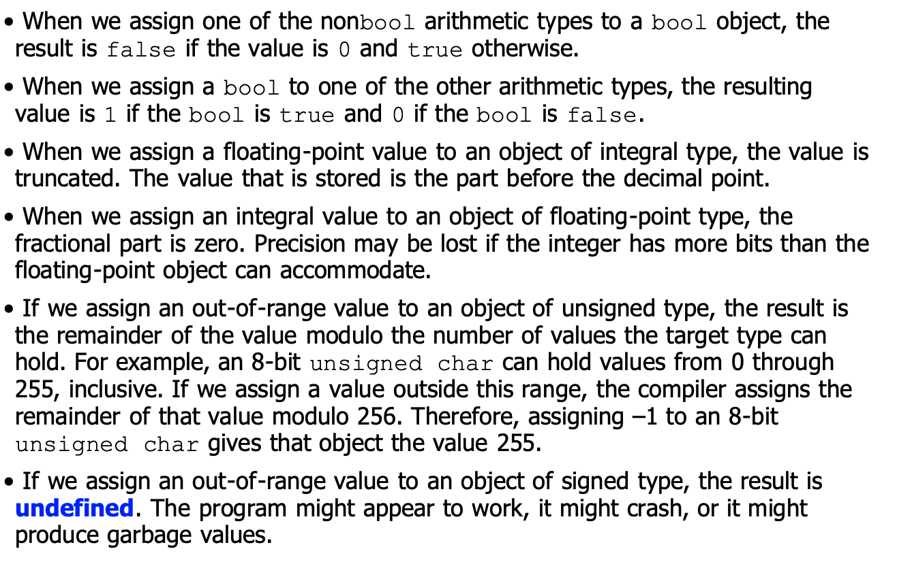

[toc]
# Part I: The Basics

<a href="../Menu.md">Click here to return to my main page</a>

## Chapter 2 Variables and Basic Types

### 2.1 Primitive Built-in Types

#### 2.1.1 Arithmetic Types

##### Categories of Arithmetic Types

Integral Type: character and boolean types

Floating-point Type: floating, double

##### Arithmetic Types


1. A char is the same size as a single machine byte.
2. Actually, the size of int is decided by the length of one block of CPU(int位数取决于计算机CPU的位数)

##### Signed and Unsigned Types

For char, there are three types: char, signed char, unsigned char. char uses one of signed chars and unsigned chars, it depends on the compiler.


1. What is the difference between long and int?

   in 16-bit system : int is 2 bytes and long is 4 bytes

   in 32-bit system : int and long are both 4 bytes

   in 64-bit system : int is 4 bytes and long is 8 bytes, long long is also 8 bytes.

2. What is the difference between float and double? 

   float is 4 bytes and double is 8 bytes.
   float: 数符(1 bit，数的正负)，尾符(0.xxxx)，指数符(1, 指数正负)，指数
   double is the double of float :)

#### 2.1.2 Type Conversions

```
   bool b = 42; //b is true 
   int i = b; //i has value 1
   i = 3.14; // i has value 3
   double pi = i; // pi has value 3.0
   unsigned char c = -1; //assuming 8-bit char, c has value 255
   signed char c2 = 256; //assuming 8-bit chars, the value of c2 is undefined
```

#### 2.1.3 Literals(字面值常量)
This sections means that how you could express different types of variables. For
##### Interger and Floating Point Literals
Decimal: `20`
Octal: `024`
Hex: `0x14`
By default, decimal literals are signed, the type of this data is the shortest one among int, long and long long.
Octal and hex can be either signed of unsigned, the type of this data is the shortest among int, unsigned int, long, unsigned long, long long and unsigned long long.
By default, floating-point literals have type double.
##### Character and Character String Literals
type char: A character enclosed within single quotes
type string: zero or more characters enclosed in double quotation
The type of string is array of constant chars. 
The compiler appends a null character`'\0'` to every string literals
Two string literals that appear adjacent to one another and that are seperated only by spaces, tabs, or newlines are concatenated into a single literal.
```
std::cout<<"a really, really long string literal"
         "could be seperated in this way to fit comfortably"<<std::endl
```
if you want to represent any char with the form of '/xxxx', be careful that the compiler will only consider the first 3 words as effective letters.
##### Specifying the Type of a Literal

```
L'a';//wchar_t
u8"hi!"; //utf-8 string
42ULL;// unsigned long long
1E-3F;//float
3.14159L;//long double
```

### 2.2 Variables
#### 2.2.2 Variable Declarations and Definitions
To realize the separate compilation, C++ separate declaration and definition
Declaration: makes a name known to the program. 
Definition: creates the entity physically and virtually.
```
extern int i; // declares but does not defined
int j; // declare and defined
```
Variables must be defined exactly once but can be declared many times.
If you want to use a variable in more than one file, you need to define that variable in one file and declare it in multiple files.

#### 2.2.3 Identifiers
Some regulations for naming a variable, nothing important I think?

#### 2.2.4 Scope of a Name
Global Scope: the name which is defined outside any curly braces, which could be accessible throughout the program.
Block Scope: the name which is defined within the scope of the block and it is accessible from its point of declaration throughout the rest of the main but not outside of it.
Inner Scope: the contained scope
Outer Scope: the containing scope

### 2.3 Compound types
#### 2.3.1 Reference
reference defines an alternative name for an object.
reference相当于在初始化的时候就被绑定到了variable上，所以改变它的值就是在改变它指向的那个variable的value
We can define multiple references in a single definition.
#### 2.3.2 Pointers
The value stored in a pointer can be in one of four states: 
1. It can point to an object
2. It can point to the location just immediately past the end of an object 
3. It can be a null pointer, indicating that it is not bound to any object.
4. It can be invalid; values other than the preceding three are invalid.

Null Pointers: 
several ways to obtain a null pointer:
```
int *p1 = nullptr;
int *p2 = 0;
int *p3 = NULL;
```

##### void * pointer
A special pointer type that can hold the address of any object. A void* pointer holds an address, but the type of the object at that address is unknown.
```
void *pv = &obj;//such pointer could hold the pointer of any type.
```
But the usage of void* pointer is limited. We can not use a void* to operate on the object it addresses.

#### 2.3.3 Understanding Compound Type Declarations
A single definition might define variables of different types:
```
int i = 1024, *p = &i, &r = i;
int *p1, p2; // p1 is pointer but p2 is int.
```
References to Pointers
```
int i = 42;
int *p1;
int *&r = p;// r is a reference to pointers p
r = &i;
*r = 0;// in this state, the value of i is changed to 0;
```

### 2.4 Const Qualifier
当以编译初始化的方式定义一个const对象时，编译器将在编译过程中把用到该变量的地方都替换成对应的值
如果只想在一个文件定义const但是需要在其他文件中用到const，则：
```
   extern const int bufSize = fcn();// define in the file.cc
   extern const int bufSize;// extern in the file.h
```
#### 2.4.1 References to const
1. Reference to a const must be a const.
2. Reference to a const cannot be changed.
```
   const int ci = 1024;
   const int &r1 = ci;
```
const reference: 不能改变其指向的值，不管它指向的值是不是const

#### 2.4.2 Pointers and const
pointer to const: 指向常量，无法改变它指向的值
可以指向非const但是依然无法改变指向的值

##### const Pointers
the pointer itself is a const
```
   int num = 0;
   int *const cur = &num;
   const double pi = 3.14;
   const double *const pip = &pi;// a const pointer which points to a const double
```
#### 2.4.3 Top-level const
top-level const: A const pointer
low-level const: A pointer points to a const

