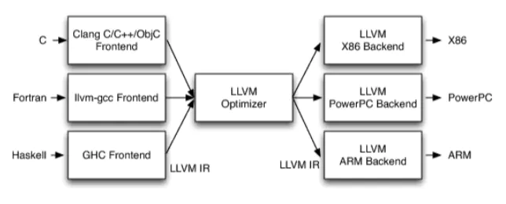

# LLVM Introduction

LLVM项目是模块化、可重用的编译器以及工具链技术的集合。

## 传统编译器架构

Souce Code -> Frontend|Optimizer|Backend -> Machine Code

前端： 词法分析，语法分析，语义分析
优化器：中间代码优化
后端：生成机器码

## llvm 架构

* 不同的前端后端都可以使用统一的中间代码
* 优化阶段可以适用于各种前端语言和后端语言
* llvm现在被作为实现各种静态和运行时编译语言的通用基础结构

[Source](https://www.jianshu.com/p/1367dad95445)
